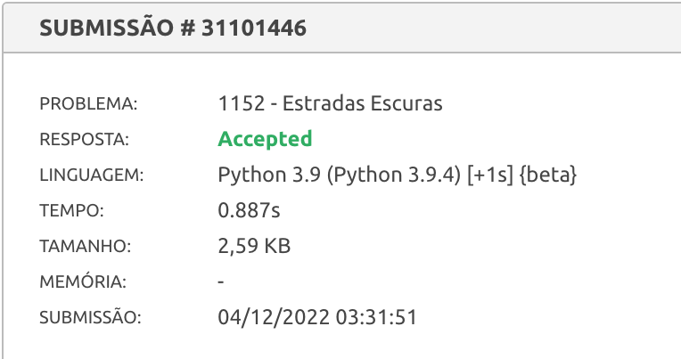

# Estradas Escuras

*Questão 1152 | Beecrowd*  
*[Link para o problema](https://www.beecrowd.com.br/judge/pt/problems/view/1152)*

### **Descrição**

Nestes dias se pensa muito em economia, mesmo em Byteland. Para reduzir custos operacionais, o governo de Byteland decidiu otimizar a iluminação das estradas. Até agora, todas as rotas eram iluminadas durante toda noite, o que custava 1 Dólar Byteland por metro a cada dia. Para economizar, eles decidiram não iluminar mais todas as estradas e desligar a iluminação de algumas delas. Para ter certeza que os habitantes de Byteland continuem a se sentirem seguros, eles querem otimizar o sistema de tal forma que após desligar a iluminação de algumas estradas à noite, sempre existirá algum caminho iluminado de qualquer junção de Byteland para qualquer outra junção.

Qual é a quantidade máxima de dinheiro que o governo de Byteland pode economizar, sem fazer os seus habitantes sentirem-se inseguros?

### **Entrada**

A entrada contém vários casos de teste. Cada caso de teste inicia com dois números m (1 ≤ m ≤ 200000) e n (m-1 ≤ n ≤ 200000), que são o número de junções de Byteland e o número de estradas em Byteland, respectivamente. Seguem n conjuntos de três valores inteiros, x, y e z, especificando qual será a estrada bidirecional entre x e y com z metros (0 ≤ x, y < m e x ≠ y).

A entrada termina com m=n=0. O grafo especificado em cada caso de teste é conectado. O tamanho total de todas as estradas em cada caso de teste é menor do que 2^31.

### **Saída**

Para cada caso de teste imprima uma linha contendo a máxima quantidade diária de dólares de Byteland que o governo pode economizar.

| **Exemplo de Entrada** | **Exemplo de Saída**|
|-------|--------|
| 7 11 0 1 7 0 3 5 1 2 8 1 3 9 1 4 7 2 4 5 3 4 15 3 5 6 4 5 8 4 6 9 5 6 11 0 0|51 |

### Resultado

