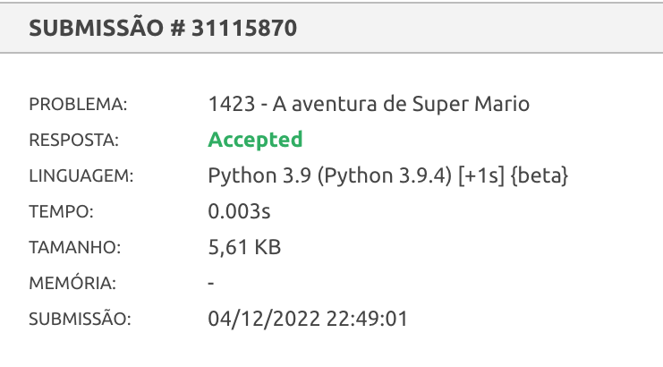

# A aventura de Super Mario

*Questão 1423 | Beecrowd*  
*[Link para o problema](https://www.beecrowd.com.br/judge/pt/problems/view/1423)*

### **Descrição**

Depois de resgatar a bela princesa, Super Mario precisa achar o caminho de casa - com a princesa é claro :-). Ele é familiarizado com "Mundo de Super Mario", então ele não precisa de uma mapa, precisa apenas da melhor rota a fim de ganhar tempo.

Existem A Vilas e B Castelos neste mundo. Vilas são numeradas 1..A, e Castelos são numerados A+1..A+B. Mario vive na Vila 1, e o Castelo que ele começa é numerado A+B. Também, existem uma via de mão dupla conectando-os. Dois lugares são conectados no máximo por uma rua e um lugar jamais tem uma rua conectando-o a si mesmo. Mario já mediu o comprimento de cada rua, mas não quer caminhar todo o percurso, já que ele se move uma unidade tempo para cada unidade de distância (que lento!).

Por sorte, Mário encontrou botas mágicas no Castelo onde havia salvado a princesa. Se ele as utilizar, poderá fazer uma super-corrida de um lugar a outro EM TEMPO ZERO. (Não se preocupe com a princesa, Mario encontrou um jeito de levá-la em sua super-corrida, mas ele não contará a você:-P).

Uma vez que existem armadilhas nos Castelos, Mario NUNCA faz uma super-corrida através de um Castelo. Ele sempre para quando há um Castelo no caminho. Ele também começa/para suas super-corrridas SOMENTE em Vilas e Castelos.

Infelizmente, as botas mágicas são velhas, então Mário não pode usar mais que L quilômetros de uma vez, e não pode usar mais que K vezes no total. Quando chegar em casa, ele pode repará-las e usá-las novamente.

### **Entrada**

A primeira linha da entrada contém um único inteiro T, indicando o número de casos de teste (1 ≤ T ≤ 20). Casa caso de teste começa com cinco inteiros A, B, M, L e K - o número de Vilas, o número de Castelos (1 ≤ A, B ≤ 50), o número de ruas, a distância máxima que pode ser coberta de uma vez (1 ≤ L 500), e o número de vezes as botas podem ser usadas (0 ≤ K ≤ 10). As próximas M linhas, cada uma contém três inteiros Xi, Yi, Li. Isso significa que há uma rua conectando os lugares Xi e Yi. A distância é Li, então o tempo de caminhada é também Li (1 ≤ Li ≤ 100).

### **Saída**

Para cada caso de teste na entrada imprima uma linha contendo um único inteiro indicando o tempo mínimo necessário para ir para casa com a bela princesa. É garantido que Super Mario pode sempre ir para casa.

| **Exemplo de Entrada** | **Exemplo de Saída**|
|-------|--------|
1 4 2 6 9 1 4 6 1 5 6 10 4 5 5 3 5 4 2 3 4 1 2 3|9 |

### Resultado

